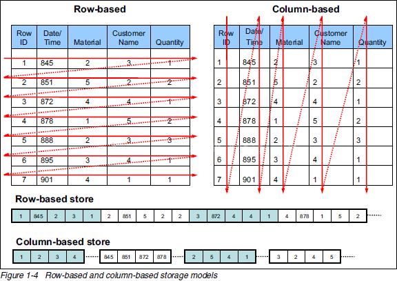
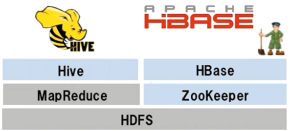

## 5.1 HBase简介

#### 1 什么是HBase

- HBase是一个分布式的、面向列的开源数据库
- HBase是Google BigTable的开源实现
- HBase不同于一般的关系数据库, 适合非结构化数据存储

#### 2 BigTable

- BigTable是Google设计的分布式数据存储系统，用来处理海量的数据的一种非关系型的数据库。
  - 适合大规模海量数据，PB级数据；
  - 分布式、并发数据处理，效率极高；
  - 易于扩展，支持动态伸缩
  - 适用于廉价设备；
  - 不适用于传统关系型数据的存储；

#### 3 面向列的数据库

**HBase 与 传统关系数据库的区别**

<table>
  <tr>
    <th></th>
    <th>HBase</th>
    <th>关系型数据库</th>
  </tr>
  <tr>
    <td> 数据库大小 </td>
    <td> PB级别  </td>
    <td>GB TB</td>
  </tr>
  <tr>
    <td> 数据类型 </td>
    <td> Bytes </td>
    <td> 丰富的数据类型 </td>
  </tr>
    <tr>
    <td> 事务支持 </td>
    <td> ACID只支持单个Row级别 </td>
    <td> 全面的ACID支持, 对Row和表</td>
  </tr>
  <tr>
    <td> 索引 </td>
    <td> 只支持Row-key </td>
    <td> 支持 </td>
  </tr>
    <tr>
    <td> 吞吐量 </td>
    <td> 百万写入/秒 </td>
    <td> 数千写入/秒</td>
  </tr>
</table>

- 关系型数据库中数据示例

<table>
  <tr>
    <th>ID</th>
    <th>FILE NAME</th>
    <th>FILE PATH</th>
    <th>FILE TYPE</th>
    <th>FILE SIZE</th>
    <th>CREATOR</th>
  </tr>
  <tr>
    <td> 1 </td>
    <td> file1.txt  </td>
    <td>/home</td>
    <td> txt </td>
    <td> 1024 </td>
    <td> tom </td>
  </tr>
  <tr>
    <td> 2 </td>
    <td> file2.txt  </td>
    <td>/home/pics</td>
    <td> jpg </td>
    <td> 5032 </td>
    <td> jerry </td>
  </tr>
</table>

- 同样数据保存到列式数据库中

<table>
<tr>
<th>RowKey</th>
<th>FILE INFO</th>
<th>SAVE INFO</th>
</tr>
<tr>
<td> 1 </td>
<td> name:file1.txt
type:txt
size:1024</td>
<td>path:/home/pics
creator:Jerry
</td>
</tr>
<tr>
<td> 2 </td>
<td>name:file2.jpg
type:jpg
size:5032</td>
<td> path:/home
creator:Tom</td>
</tr>
</table>

- 行数据库&列数据库存储方式比较

#### 4 什么是非结构化数据存储

- 结构化数据
  - 适合用二维表来展示的数据
- 非结构化数据
  - 非结构化数据是数据结构不规则或不完整
  - 没有预定义的数据模型
  - 不方便用数据库二维逻辑表来表现
  - 办公文档、文本、图片、XML, HTML、各类报表、图像和音频/视频信息等

#### 5 HBase在Hadoop生态中的地位

- HBase是Apache基金会顶级项目

- HBase基于HDFS进行数据存储

- HBase可以存储超大数据并适合用来进行大数据的实时查询

  

#### 6 HBase与HDFS

- HBase建立在Hadoop文件系统上, 利用了HDFS的容错能力
- HBase提供对数据的随机实时读/写访问功能
- HBase内部使用哈希表, 并存储索引, 可以快速查找HDFS中数据

#### 7 HBase使用场景

- 瞬间写入量很大
- 大量数据需要长期保存, 且数量会持续增长
- HBase不适合有join, 多级索引, 表关系复杂的数据模型