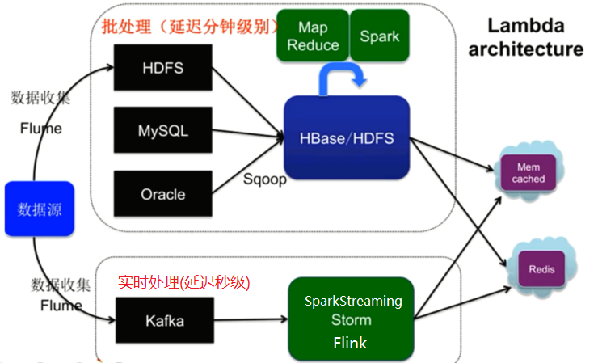

## 1.2 推荐系统设计

### 学习目标

- 了解推荐系统要素
- 记忆推荐系统架构

### 1 推荐系统要素

- UI 和 UE(前端界面)
- 数据 (Lambda架构)
- 业务知识
- 算法

### 2 推荐系统架构

- 推荐系统整体架构

  

- 大数据Lambda架构

  - Lambda架构是由实时大数据处理框架Storm的作者Nathan Marz提出的一个实时大数据处理框架。

  - Lambda架构的将离线计算和实时计算整合，设计出一个能满足实时大数据系统关键特性的架构，包括有：高容错、低延时和可扩展等。

  - 分层架构

    - 批处理层
      - 数据不可变, 可进行任何计算, 可水平扩展
      - 高延迟  几分钟~几小时(计算量和数据量不同)
      - 日志收集： Flume
      - 分布式存储： Hadoop
      - 分布式计算： Hadoop、Spark
      - 视图存储数据库
        - nosql(HBase/Cassandra)
        - Redis/memcache
        - MySQL
    - 实时处理层
      - 流式处理, 持续计算
      - 存储和分析某个窗口期内的数据（一段时间的热销排行，实时热搜等）
      - 实时数据收集 flume & kafka
      - 实时数据分析  spark streaming/storm/flink
    - 服务层
      - 支持随机读
      - 需要在非常短的时间内返回结果
      - 读取批处理层和实时处理层结果并对其归并

  - Lambda架构图

    

- 推荐算法架构

  - 召回阶段 (海选)
    - 召回决定了最终推荐结果的天花板
    - 常用算法:
      - 协同过滤
      - 基于内容
  - 排序阶段 （精选）
    - 召回决定了最终推荐结果的天花板, 排序逼近这个极限, 决定了最终的推荐效果
    - CTR预估 (点击率预估 使用LR算法)  估计用户是否会点击某个商品 需要用户的点击数据
  - 策略调整

- 推荐系统的整体架构

  

  

